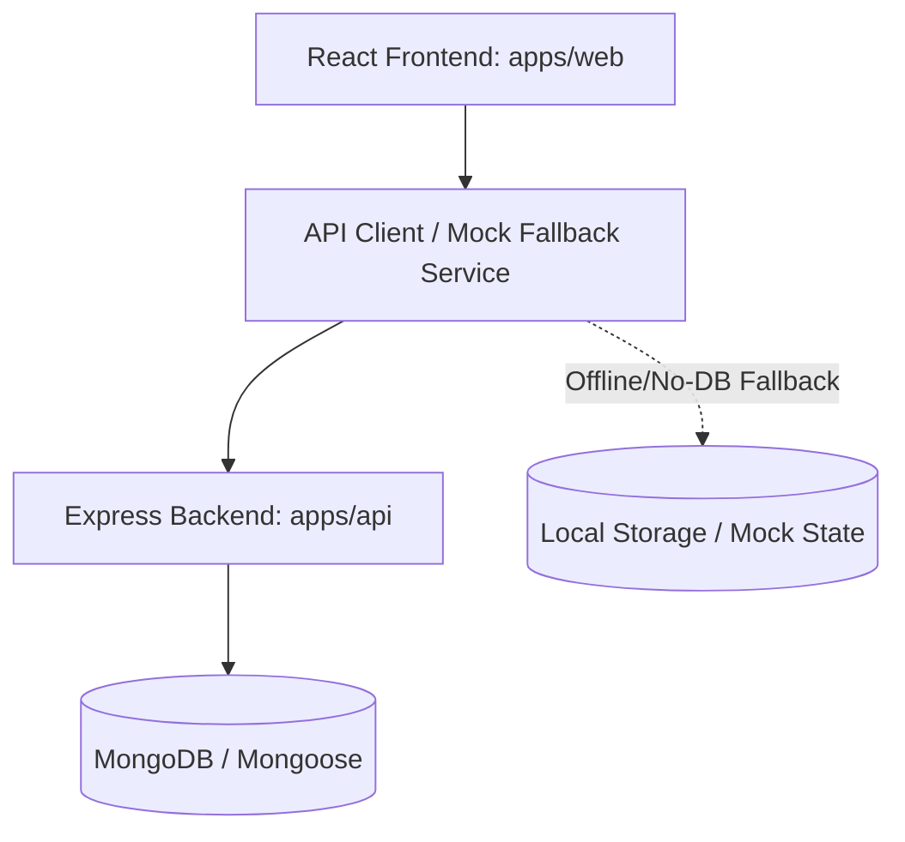

# Implementation Plan: StackPilot AI

StackPilot AI is a production-ready enterprise SaaS platform combining Project Management, CRM, Requirement Engineering, AI Document Writing, SEO Analytics, Team Management, Invoice Management, and custom Business Analytics. It serves as an all-in-one operations suite for startups, digital agencies, and software companies.

This implementation plan outlines the architecture, data models, core modules, frontend views, backend REST endpoints, and verification steps.

---

## Proposed Architecture

StackPilot AI is structured as a monorepo containing:
- **`apps/web`**: React + Vite + TypeScript + Tailwind CSS (v4) + Framer Motion. 
- **`apps/api`**: Node.js + Express.js + Mongoose + MongoDB.
- **`packages/shared`**: Shared TypeScript types, schemas, and utils.



### Clean & Feature-Based Folder Structure

For the frontend, we will structure code by feature to keep components, hooks, views, and state close together.

```
apps/web/src/
├── components/          # Reusable presentation UI elements (Button, Cards, Modals, Tables)
├── context/             # Global states (AuthContext, ThemeContext, NotificationContext)
├── features/            # Feature-Specific Modules
│   ├── auth/            # Login, Signup, Role-selection, Password reset
│   ├── dashboard/       # Multi-role dashboards (Super Admin, Dev, PM, SEO, Finance, Client)
│   ├── crm/             # Pipeline, lead tracking, contacts, interactions
│   ├── projects/        # Sprints, Gantt timeline, project health
│   ├── tasks/           # Kanban Board, List View, Task Details
│   ├── requirements/    # SRS Generator, User Stories, Acceptance Criteria
│   ├── ai/              # AI code generator, Cost estimator, Meeting minutes
│   ├── docs/            # Technical document hub (BRD, SRS, KB)
│   ├── seo/             # Blog planner, GBP dashboard, Analytics trackers
│   ├── team/            # Team roster, workload, availability
│   ├── finance/         # Invoices, Expenses, Quotations creator
│   ├── calendar/        # Team scheduling, deadlines, events
│   └── settings/        # Org details, SMTP, User Roles/Permissions, API keys
├── routes/              # React Router setup
├── services/            # Axios API client, Mock database, Fallback logic
├── types/               # Shared TS interfaces
└── utils/               # Formatting, chart helpers, document exporters
```

---

## User Review Required

> [!IMPORTANT]
> **Key Architectural Choices**
> 1. **Bimodal API System**: The frontend will use an API Service layer that automatically connects to the Node.js/Express backend at `http://localhost:5000/api`. If the server is offline or not configured, it will seamlessly fall back to an in-memory/localStorage-persisted state. This ensures that the application is fully interactive and functional instantly during local testing or static hosting.
> 2. **Role-Based Experience**: Users can toggle between roles (Super Admin, PM, Dev, Tester, BA, SEO, Finance, Client) from an easy-to-use simulator switcher in the dashboard navigation bar. This makes verifying the entire role-based permission system quick and intuitive.

---

## Open Questions

> [!NOTE]
> None. The requirements are detailed and comprehensive. We will build out all modules as requested.

---

## Proposed Changes

### 1. Database & Shared Types (`packages/shared` & `database/`)

We will define standard TypeScript interfaces and database schemas representing the core business entities.

#### [NEW] [types.ts](file:///home/saravanaselvi/FlowPilot%20AI/packages/shared/types.ts)
- Shared interfaces: `User`, `Project`, `Task`, `Lead`, `Invoice`, `Document`, `SEOReport`, `BlogPost`, `Keyword`, `ActivityLog`.

### 2. Backend API (`apps/api`)

We will initialize a clean Express app in `apps/api` with full folder organization:
- `src/models/`: MongoDB models using Mongoose (User, Project, Task, Lead, etc.).
- `src/controllers/`: Express controllers for Auth, Projects, Tasks, CRM, SEO, Finance.
- `src/middleware/`: JWT verification, Role-based auth.
- `src/routes/`: Route mappings.
- `src/server.ts`: Express application bootstrap.

#### [NEW] [package.json](file:///home/saravanaselvi/FlowPilot%20AI/apps/api/package.json)
#### [NEW] [tsconfig.json](file:///home/saravanaselvi/FlowPilot%20AI/apps/api/tsconfig.json)
#### [NEW] [server.ts](file:///home/saravanaselvi/FlowPilot%20AI/apps/api/src/server.ts)
#### [NEW] [models.ts](file:///home/saravanaselvi/FlowPilot%20AI/apps/api/src/models/index.ts)
#### [NEW] [controllers.ts](file:///home/saravanaselvi/FlowPilot%20AI/apps/api/src/controllers/index.ts)
#### [NEW] [auth.ts](file:///home/saravanaselvi/FlowPilot%20AI/apps/api/src/middleware/auth.ts)

### 3. Frontend Web Client (`apps/web`)

We will update the entry points, load Google Fonts (`Inter` & `Outfit`), and implement the entire system.

#### [MODIFY] [index.html](file:///home/saravanaselvi/FlowPilot%20AI/apps/web/index.html)
- Add Google Fonts and page titles.

#### [MODIFY] [index.css](file:///home/saravanaselvi/FlowPilot%20AI/apps/web/src/index.css)
- Implement Tailwind CSS customs, premium custom animations, typography utilities, glassmorphism templates, and scrollbar stylings.

#### [NEW] [api.ts](file:///home/saravanaselvi/FlowPilot%20AI/apps/web/src/services/api.ts)
- Setup Axios instance and endpoints.
- Include a comprehensive mock data provider fallback with local storage persistence.

#### [NEW] [AuthContext.tsx](file:///home/saravanaselvi/FlowPilot%20AI/apps/web/src/context/AuthContext.tsx)
- Provides login, register, log out, profile updates, and active user state.

#### [NEW] [components](file:///home/saravanaselvi/FlowPilot%20AI/apps/web/src/components/)
- Reusable UI elements:
  - `Sidebar.tsx`: Glassmorphic, collapsible navigation displaying features according to active role.
  - `Navbar.tsx`: Global search bar, notification center, quick command, and active role switcher.
  - `Layout.tsx`: Common shell wrapper.
  - `UI.tsx`: Buttons, Modals, Drawers, Badge, Tables, Loading Skeletons, and Empty States.

#### [NEW] [features](file:///home/saravanaselvi/FlowPilot%20AI/apps/web/src/features/)
- Create the core feature panels:
  - `auth/`: Login page, Register page, Password reset forms.
  - `dashboard/`: Multi-role view displaying specific metrics, charts, calendars, and activities.
  - `crm/`: Board-style pipeline (Leads), client tables, communications history, add-lead modal.
  - `projects/`: Project listing, project planner (sprints, team, budget), and timelines.
  - `tasks/`: Full-featured Kanban Board (drag-and-drop actions), list view, task checklist, description editor, due dates, assignees.
  - `requirements/`: Document templates for business requirements and interactive AI SRS / User Story / Acceptance Criteria generators.
  - `ai/`: AI Tools workspace. Enter prompts and receive professional code architectures, test suites, sprint plans, email copies, or cost estimates.
  - `docs/`: Document explorer, technical documentation writer, meeting minutes recorder, markdown editor, and PDF download simulation.
  - `seo/`: GBP reviews, search console performance chart (clicks, impressions), blog manager, keyword rank tracker, SEO checklists.
  - `team/`: Workforce planner, workload analysis, leaves scheduler, department breakdown.
  - `finance/`: Invoice creator (form, tax rate, discount calculations), invoice grid, beautiful client-ready PDF invoice exporter.
  - `calendar/`: Calendar visualizer showing project events, sprint dates, leaves, and call agendas.
  - `profile/`: Skill addition system, security settings, 2-Factor Authentication simulator.
  - `settings/`: Org settings, API key generator, SMTP dashboard, custom permission settings tables.

#### [MODIFY] [App.tsx](file:///home/saravanaselvi/FlowPilot%20AI/apps/web/src/App.tsx)
- Connect React Router, Auth Provider, Toast Notification Providers, and setup path routes.

---

## Verification Plan

### Automated Verification
- Run typescript compilation in both backend and frontend (`tsc -b`).
- Compile Vite dev build (`npm run build` in web directory).
- Verify that standard React routers, loaders, and dependencies mount without crashes.

### Manual Verification
- We will open a browser testing subagent.
- Navigate to `http://localhost:5173` (or the default Vite port) using the browser subagent.
- Perform login, verify dashboard panels, toggle roles, test the CRM pipeline, create a project, generate an AI SRS document, create an invoice, and test the global search interface.
- Record the video demo using the browser subagent recording features.
